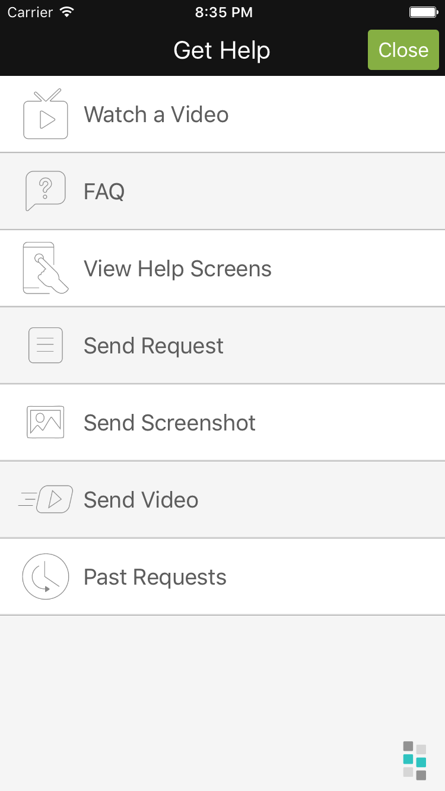
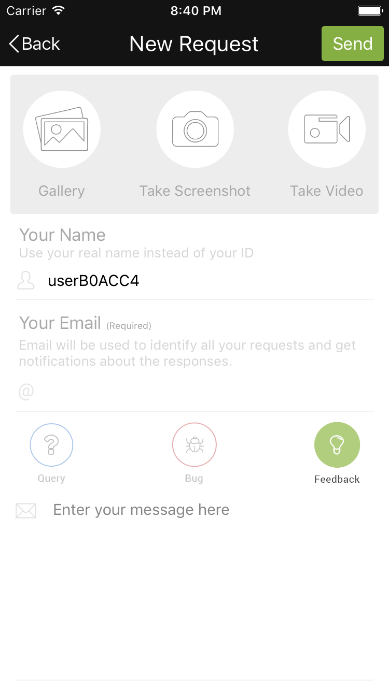
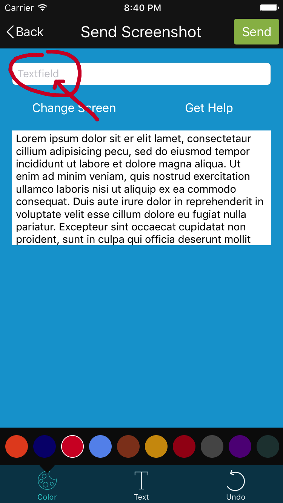

<h1>Introduction</h1>

Backbone Bits is an amazing tool to pitch your app to the major mobile platforms that are effective for both new and existing apps.
This documentation will help you to add and configure your apps with Backbone Bits tool. You can gain deep insight and easily respond all of your apps very quickly and with little effort using Backbone Bits's iOS SDK. The SDK integration process is designed to be as easy as possible with a basic setup complete in under 5 minutes.


<h1>Screenshots</h1>

<div width="1200">



</div>


<h1>Features</h1>

 - <b>Respond </b> - Communicate efficiently with in-app user interactions.
 -  <b>Help </b>- Help images, videos, and FAQs.
 - <b>Supports</b> -iOS 8.0 and up


<h1>Getting Started</h1>


> Initialise Backbone Bits with API Key. You can enable or disable helper on device shake 

```
[[Backbonebits sharedInstance] startWithApiKey:@"Your API Key"];
[[Backbonebits sharedInstance] setEnableShakeGesture:false] //Default value true
```

> You can open helper on click of view in your application: 

```
- (IBAction)btnGetHelpTapped:(id)sender {
    [[Backbonebits sharedInstance] openHelpAndRespondOptions];
}
```


<h1>Configure Push Notification:</h1>

> Write the following line of code in the `application:didFinishLaunchingWithOptions:`

```
// Register remote notification.
[[Backbonebits sharedInstance] registerForRemoteNotification];

// Handle remote notification.
if (launchOptions) {
    if ([[Backbonebits sharedInstance] handleNotification:launchOptions andOpenReportDetail:NO]) {
        // Add Your Code.
    }
}
```

<br/>
> Register remote notificaiton token to Backbone Bits

```
- (void)application:(UIApplication *)application didRegisterForRemoteNotificationsWithDeviceToken:(NSData *)deviceToken {
    [[Backbonebits sharedInstance] updateDeviceToken:deviceToken];
}
```

<br/>
> Handle remote notification for Backbone Bits

```
// iOS 8 and later
- (void)application:(UIApplication *)application didReceiveRemoteNotification:(NSDictionary *)userInfo {
    
    if ([[Backbonebits sharedInstance] handleNotification:userInfo andOpenReportDetail:YES]) {
        // Backbone Bits
    }
    else {
        // Else.
    }
}

// iOS 8 and above
- (void)userNotificationCenter:(UNUserNotificationCenter *)center willPresentNotification:(UNNotification *)notification withCompletionHandler:(void (^)(UNNotificationPresentationOptions))completionHandler {
    completionHandler(UNNotificationPresentationOptionAlert);
}

- (void)userNotificationCenter:(UNUserNotificationCenter *)center didReceiveNotificationResponse:(UNNotificationResponse *)response withCompletionHandler:(void (^)())completionHandler {
    NSDictionary * userInfo = response.notification.request.content.userInfo;
    if ([[Backbonebits sharedInstance] handleNotification:userInfo andOpenReportDetail:YES]) {
        // Backbone Bits
    }
    else {
        // Else.
    }
}
```

> To Open All Past Generated Reports in Your Project : 

```
[[Backbonebits sharedInstance] openPastReports:^(BOOL success) {
    // Completion Block
}];
```


> To Show Past Requests Unread Count in Your Project: 

```
[[Backbonebits sharedInstance] getUnreadPastRequestCount:^(NSInteger unreadCount, NSError *error) {
    // Completion Block
}];
```


<h1>Bugs and Feedback</h1>

For bugs, questions and discussions please use the Github Issues.


<h1>License</h1>

The MIT License (MIT)
<br/><br/>
Copyright (c) 2018 INTUZ
<br/><br/>
Permission is hereby granted, free of charge, to any person obtaining a copy of this software and associated documentation files
(the "Software"), to deal in the Software without restriction, including without limitation the rights to use, copy, modify,
merge, publish, distribute, sublicense, and/or sell copies of the Software, and to permit persons to whom the Software is
furnished to do so, subject to the following conditions:
<br/><br/>
THE SOFTWARE IS PROVIDED "AS IS", WITHOUT WARRANTY OF ANY KIND, EXPRESS OR IMPLIED, INCLUDING BUT NOT LIMITED TO THE WARRANTIES OF
MERCHANTABILITY, FITNESS FOR A PARTICULAR PURPOSE AND NONINFRINGEMENT. IN NO EVENT SHALL THE AUTHORS OR COPYRIGHT HOLDERS BE
LIABLE FOR ANY CLAIM, DAMAGES OR OTHER LIABILITY, WHETHER IN AN ACTION OF CONTRACT, TORT OR OTHERWISE, ARISING FROM, OUT OF OR IN
CONNECTION WITH THE SOFTWARE OR THE USE OR OTHER DEALINGS IN THE SOFTWARE.
  

<h1>More Open Source by INTUZ</h1>

 <br/>
 <br/>
 <a href="https://github.com/Intuz-production/Backbone-bits-Android" target="_blank">Backbone bits Android SDK</a>
<br/>
<a href="https://github.com/Intuz-production/Backbone-bits-PHP" target="_blank">Backbone bits PHP SDK</a>
 
 <br/> <br/>

<a href="https://www.intuz.com/" target="_blank"></a>
